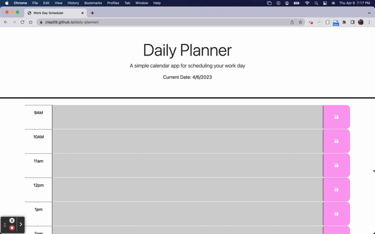

# Daily-Planner

## Description 

Daily planner is a dynamic daily calendar that stores user inputted information for later use. It is a simple and easy to use digital planner that one can edit and adjust as needed throughout the day. Colors change depending on the hour, gray is past, red is present and the future green.  

[Live Site Link Here](https://ctep09.github.io/daily-planner/)

## Usage 

Once the user reaches the site they can immediately start entering text into the desired time slot and save as well. The text inside the boxes can be modified at any time, the user just needs to press save before exiting the page. 

## Built With

* [HTML](https://developer.mozilla.org/en-US/docs/Web/HTML)
* [CSS](https://developer.mozilla.org/en-US/docs/Web/CSS)
* [Javascript](https://developer.mozilla.org/en-US/docs/Web/JavaScript)
* [jQuery](https://api.jquery.com/)
* [BootStrap](https://getbootstrap.com/docs/5.2/getting-started/introduction/)

## Author

**Cassandra Tepper** 

- [Link to Github](https://github.com/CTep09)
- [Link to LinkedIn](https://www.linkedin.com/in/cassie-tepper/)

## License

This project is licensed under the MIT License 